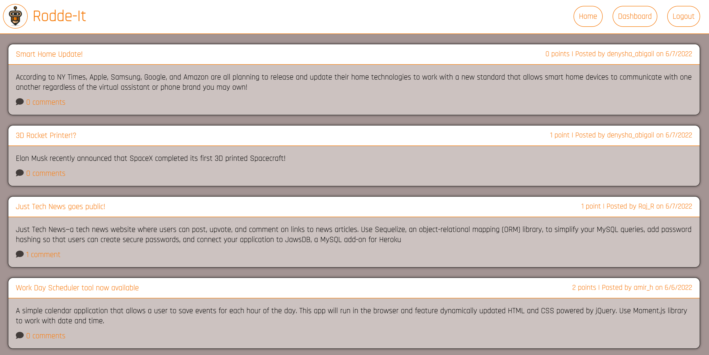

# Rodde-It ✏️

[](https://opensource.org/licenses/ISC)

## Description
This full stack web application utilizes HTML, CSS, Handlebars, JavaScript, MySQL, Node.js, and Node Package Manager (bcrypt, connect-session-sequelize, dotenv, express, express-handlebars, express-session , handlebars, mysql2, sequelize) to build an MVP startup forum resembling Reddit. Through the implementation of the MVC paradigm, Object-Relational Mapping, CRUD functionality, template generating engines, and authentication features, users have the ability to:

- Sign up and create an account
- Log in as a returning user
- Create, edit, view, and delete posts
- Add comments to posts
- Upvote or Downvote on posts
- Navigate to Sign up, Log in, Home, Dashboard, and Edit pages

> Visit the deployed Heroku site [HERE](https://rodde-it.herokuapp.com/)

## Table of Contents
  - [Installation](#installation)
  - [Usage](#usage)
  - [Preview](#preview)
  - [License](#license)
  - [Contribution](#contribution)
  - [Questions](#questions)
  - [Credits](#credits)

## Installation
### Optional:
- Prior to starting up the program, make sure you have [Node.js](https://nodejs.org/en/download/), [MySQL](https://coding-boot-camp.github.io/full-stack/mysql/mysql-installation-guide), and [Insomnia](https://insomnia.rest/download) installed onto your local computer for testing purposes.

- To install this application, clone this repository onto your local computer, open it in your code editor, and run the following command on your terminal: ```npm install```

- Once all dependencies have been installed, create an environment variable file (.env) at the root level of this application with the following content for successful connection to the database:
    - DB_NAME = platform_db
    - DB_USER = <'mysql-username-here'> (If no username is set, default user for SQL is 'root')
    - DB_PW = <'mysql-password-here'> (If no password is set, by default SQL has no password)

## Usage
### Optional:
- Once all packages have been installed, run the mysql shell command ```mysql -u root -p``` and enter your password (if one has been set) before running ```source db/schema.sql```. Once completed, type ```exit```.

- After exiting the mysql shell, run the command ```npm start```, ```npm run start``` OR ```node server.js``` on your terminal to turn on your server.

- Once the server has been turned on, head over to Insomnia to test API GET, POST, PUT, and DELETE routes in order to create, read, update, and delete data from the SQL database.  

## Preview


## License
- This project is licensed under: [ISC](https://opensource.org/licenses/ISC)

## Contribution 
- Forking this repository is always welcomed and encouraged!

> If you encounter a problem with this application, please add an issue or pull request to the GitHub repository. 

## Questions
- Please feel free to use this application at any time and visit our personal GitHub profiles to access other open source projects! 

## Credits
- Denysha Guerrios-Armaiz, 06/2022 | [GitHub](https://github.com/denysha-abigail) | [Portfolio](https://denysha-abigail.github.io/denysha-abigail.io/) | [LinkedIn](https://www.linkedin.com/in/denysha-guerrios-armaiz-ab2750229/)

- Amir Hackett, 06/2022 | [GitHub](https://github.com/Amir-Hackett) | [Portfolio](https://amir-hackett.github.io/Professional-Portfolio/) | [LinkedIn](https://www.linkedin.com/in/amir-hackett/) 

- Dean Ketchmark, 06/2022 | [GitHub](https://github.com/DeanK24) | [Portfolio](https://deank24.github.io/Coding-Portfolio/)

- Disha Barua, 06/2022 | [GitHub](https://github.com/Disha2022) | [Portfolio](https://disha2022.github.io/disha-portfolio/) | [LinkedIn](https://www.linkedin.com/in/dishaaa/)
